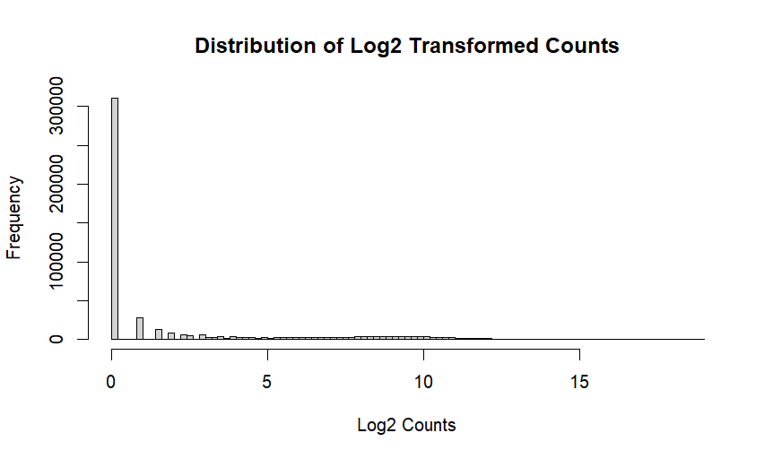
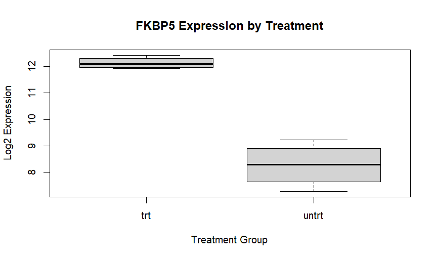

# Exploratory RNA-Seq Analysis of the Airway Dataset in R

## Overview

This project explores the Bioconductor Airway RNA-seq dataset using R.

The goal was to learn how transcriptomics datasets are structured, how gene expression data can be extracted and transformed, and how biological insights can be obtained through exploratory analysis.

---

## Dataset

Source: Bioconductor Airway Dataset

The dataset contains RNA-seq expression measurements from human airway smooth muscle cells treated with dexamethasone and untreated controls.

---

## Skills Demonstrated

- Loading Bioconductor datasets
- Working with SummarizedExperiment objects
- Exploring sample metadata
- Exploring gene annotations
- Extracting count matrices
- Log2 transformation of RNA-seq counts
- Histogram visualization
- Boxplot visualization
- Gene-specific expression analysis

---

## Key Findings

## Figures

### Distribution of Log2 Transformed Counts



### Sample Expression Distribution



### Sample Quality Assessment

Log-transformed expression distributions were similar across all samples, suggesting good consistency among RNA-seq libraries.

### FKBP5 Expression

FKBP5 showed consistently higher expression in dexamethasone-treated samples compared to untreated samples.

This observation aligns with the known glucocorticoid response of FKBP5.

---

## Technologies Used

- R
- Bioconductor
- airway package

---

## Repository Structure

```text
MiniProject2_RScript.R
README.md
figures/
```

---

## Author

Dharmarajan Selvaraj

MSc Bioinformatics Student
